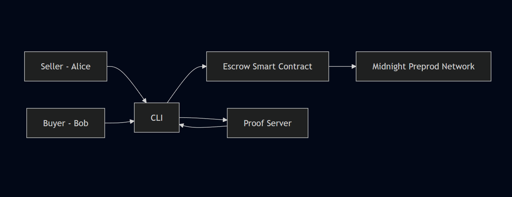

# Midnight Escrow Contract

[](https://shields.io/) [](https://shields.io/) [](https://shields.io/) [](https://shields.io/)

A **privacy-preserving escrow contract built on the Midnight Network**. A buyer deposits funds which are released to a seller only when the seller proves knowledge of a secret agreed upon at escrow creation — verified entirely by a Zero-Knowledge Proof, with no trusted intermediary.

The project serves as a **reference implementation** for developers building privacy-preserving financial primitives on Midnight.

---

# Overview

Traditional escrow systems require a trusted third party. This implementation replaces that trust with cryptography.

The contract enforces the following rules in ZK:

* Only the key derived from the buyer's secret key can create or refund an escrow
* Only the key derived from the seller's secret key can accept or release an escrow
* Release is only permitted when the seller can prove they hold the correct `(releaseSecret, nonce, amount)` triple that matches the commitment stored on-chain at creation time

No secret values are ever written to the public ledger. All verification happens inside ZK circuits compiled from the Compact contract.

---

# Demo

▶️ **YouTube Demo:**
*(COMING SOON)*

The demo shows:

1. Contract deployment on Midnight Preprod
2. Escrow creation by buyer (Bob)
3. Escrow acceptance by seller (Alice)
4. Secret-based conditional release
5. Funds claimed by Alice

---

# Features

### Zero-Knowledge Release Verification

At creation the buyer commits to `persistentCommit([amount_bytes || hash(releaseSecret)], nonce)`. At release the seller must reproduce this commitment exactly, proving they have the correct secret and nonce — without revealing either value on the ledger.

### Derived Identity Keys

Participant identities (`buyer`, `seller` ledger fields) are **derived public keys**: `persistentHash(["midnight:escrow:key", secretKey])`. Raw secret keys are never disclosed on-chain.

### Privacy-Preserving State Machine

The contract enforces a strict four-state machine:

```
EMPTY → FUNDED → RELEASED
                → REFUNDED
```

Every circuit asserts the current state before acting, preventing double-spend and invalid transitions.

### Interactive CLI

A full-featured CLI supports all escrow operations with an interactive menu:

* Deploy new escrow contract
* Join existing escrow contract by address
* Create escrow (buyer)
* Accept escrow (seller)
* Release funds with secret proof (seller)
* Refund (buyer)
* Monitor DUST balance
* Show escrow identity (encryption public key)

### Isolated Private State Per Run

Each CLI session uses a randomly suffixed LevelDB store name (`escrow-private-state-<random>`), preventing decryption failures when switching wallet seeds between runs.

---

# Project Structure

```
.
├── contract/                          # Midnight Compact smart contract
│   ├── src/
│   │   ├── escrow.compact             # Contract logic (circuits, state machine)
│   │   ├── witnesses.ts               # ZK witness definitions (EscrowPrivateState)
│   │   ├── index.ts                   # Package entry point
│   │   └── test/
│   │       ├── escrow-simulator.ts    # In-process contract simulator
│   │       └── escrow.test.ts         # 50 unit tests (Vitest)
│   │   └── managed/escrow/            # Compact compiler output (generated)
│   ├── package.json
│   └── tsconfig.json
│
├── escrow-cli/                       # CLI client
│   ├── src/
│   │   ├── api.ts                     # Wallet, provider setup, contract calls
│   │   ├── cli.ts                     # Interactive menu and user flows
│   │   ├── config.ts                  # Network configs (Preprod, Preview, Standalone)
│   │   ├── common-types.ts            # Shared TypeScript types
│   │   ├── logger-utils.ts            # Pino logger (file + pretty stdout)
│   │   ├── preprod.ts                 # Preprod entry point
│   │   ├── preprod-start-proof-server.ts
│   │   ├── preview.ts                 # Preview network entry point
│   │   ├── preview-start-proof-server.ts
│   │   └── standalone.ts              # Standalone / local entry point
│   ├── proof-server.yml               # Docker Compose: proof server only
│   ├── standalone.yml                 # Docker Compose: full local stack
│   └── package.json
│
├── package.json                       # npm workspace root
├── package-lock.json
└── README.md
```

---

# Architecture

## Components

### 1. Compact Smart Contract (`contract/src/escrow.compact`)

Written in Midnight's **Compact language**. Defines:

* **Ledger state**: `buyer`, `seller` (derived keys), `termsCommitment`, `state` (enum), `round` (counter)
* **Witnesses**: `secretKey`, `releaseSecret`, `nonce`, `escrowAmount` (supplied privately per circuit call)
* **Circuits**: `createEscrow`, `acceptEscrow`, `release`, `refund`, `getReleaseHash`

### 2. Witness Layer (`contract/src/witnesses.ts`)

Defines `EscrowPrivateState`:

```typescript
type EscrowPrivateState = {
  secretKey: Uint8Array;      // 32 bytes — identity key
  releaseSecret: Uint8Array;  // 32 bytes — pre-image of the commitment
  nonce: Uint8Array;          // 32 bytes — commitment randomness
  amount: bigint;             // escrow value
}
```

Witness functions feed private state into ZK circuits at proof time.

### 3. CLI Client (`escrow-cli/src/`)

* **`api.ts`** — builds the wallet (HD keys → shielded + unshielded + dust sub-wallets), configures providers, and wraps each contract circuit call
* **`cli.ts`** — interactive readline menu
* **`config.ts`** — `PreprodConfig`, `PreviewConfig`, `StandaloneConfig` for different networks

### 4. Proof Server

A local Docker service (`midnightntwrk/proof-server:7.0.0`) that generates ZK proofs. Runs at `http://127.0.0.1:6300`.

### 5. Midnight Network (Preprod / Preview)

Verifies ZK proofs and stores contract state on-chain. The CLI connects via indexer GraphQL and an RPC node.

---

## Architecture Diagram



---

## Contract State Machine

```
             createEscrow(sellerPk, amount)
  [EMPTY] ──────────────────────────────────► [FUNDED]
                                                  │
                              ┌───────────────────┴───────────────────┐
                              │                                       │
                    release()  │                             refund()  │
                  (seller + ZK proof)                     (buyer only) │
                              ▼                                       ▼
                          [RELEASED]                            [REFUNDED]
```

All transitions assert the current state. Invalid transitions (e.g. release on REFUNDED, double-release) throw a circuit assertion error.

---

## ZK Commitment Scheme

On `createEscrow`, the buyer stores:

```
termsCommitment = persistentCommit([amount_as_bytes32 || hash(releaseSecret)], nonce)
```

On `release`, the seller recomputes:

```
recomputed = persistentCommit([amount_as_bytes32 || hash(releaseSecret)], nonce)
assert(recomputed == termsCommitment)
```

This is fully verified inside the ZK circuit; the seller's `releaseSecret` and `nonce` are private witness inputs that never appear on the public ledger.

---

# Getting Started

## Prerequisites

* Node.js (v18+)
* Docker (for the Proof Server)
* Access to the Midnight Preprod faucet

> ⚠️ **Important**: Each CLI run creates a fresh isolated LevelDB private state store. Run only **one CLI session at a time** to avoid port/resource conflicts.

---

## Installation

### 1. Clone and install

```bash
git clone https://github.com/tusharpamnani/midnight-escrow.git
cd midnight-escrow
npm install
```

### 2. Compile the contract

```bash
cd contract
npm run compact
```

This generates `contract/src/managed/escrow/` from `escrow.compact`.

### 3. Build

```bash
cd contract && npm run build
cd ../escrow-cli && npm run build
```

### 4. Run tests

```bash
cd contract
npm run test
```

Expected output: **50 tests passing** across 6 test groups.

---

# Running the CLI

## Step 1 — Start the Proof Server (Terminal 1)

```bash
cd escrow-cli
docker compose -f proof-server.yml up
```

Wait for:

```
Actix runtime found; starting in Actix runtime
```

Keep this terminal running throughout the session.

## Step 2 — Run the CLI (Terminal 2)

```bash
cd escrow-cli
npm run preprod
```

The CLI will prompt you to create or restore a wallet, then show the interactive escrow menu.

> **Alternative networks:**
> ```bash
> npm run preview     # Midnight Preview network
> npm run standalone  # Local Docker stack (requires standalone.yml)
> ```

---

# Test Data for Alice & Bob

> ⚠️ **For testing only. Never use these seeds on mainnet.**

## Alice — Seller / Deployer

```
seed: 57bb166cb6bbf3a6cb5e93a26043e3e2d3c830b63b85286fe97619456a2a23f2
```

Role: deploys the contract, provides escrow identity, accepts and releases funds.

## Bob — Buyer / Funder

```
seed: 2b477c42d95b5eb49222b25f9e5267c44cb15bef9646f086248bff24f43e727f
```

Role: funds the escrow, defines the release secret.

```
test release secret: 4f8c2a9d7b1e3c5a8d6f2e9a1c4b7d8e5f3a9c2d6b1e4f8a7c9d2e5b6a1f3c4a
```

---

# Usage Flow

## Phase 1 — Deploy (Alice)

```
npm run preprod
```

1. Choose **[2] Restore wallet from seed** → enter Alice's seed
2. Wait for wallet sync and DUST generation
3. Choose **[1] Deploy new escrow contract** — copy the printed contract address
4. Choose **[6] Show My Escrow Identity** — copy the printed encryption public key
5. Exit with **[7] Disconnect**

---

## Phase 2 — Fund Escrow (Bob)

```
npm run preprod
```

1. Choose **[2] Restore wallet from seed** → enter Bob's seed
2. Wait for wallet sync and DUST generation
3. Choose **[2] Join existing escrow contract** → paste Alice's contract address
4. Choose **[1] Create Escrow (Buyer)**:
   - Paste Alice's **escrow public key** (encryption key from Phase 1)
   - Enter an amount
   - Enter the test release secret (64 hex chars)
5. The CLI prints a **NONCE** — share both the nonce and secret with Alice
6. Exit with **[7] Disconnect**

---

## Phase 3 — Release Funds (Alice)

```
npm run preprod
```

1. Choose **[2] Restore wallet from seed** → enter Alice's seed
2. Choose **[2] Join existing escrow contract** → paste the contract address
3. Choose **[2] Accept Escrow (Seller)** — verifies Alice is the designated seller
4. Choose **[3] Release Funds (Seller)**:
   - Enter the amount, secret, and nonce Bob provided
5. The ZK proof is generated and submitted — funds are released to Alice

---

## Refund Path (Bob)

If Alice never accepts, Bob can reclaim the escrow:

```
[4] Refund
```

---

# Testing

The contract has a comprehensive Vitest test suite with **50 unit tests** covering all contract behaviour without requiring a network or proof server.

```bash
cd contract && npm run test
```

| Group | Tests | Coverage |
|---|---|---|
| **deployment** | 4 | Initial state, field defaults, determinism |
| **escrow lifecycle** | 8 | All state transitions, ledger field correctness, full end-to-end |
| **access control** | 6 | Buyer/seller/third-party role enforcement |
| **secret & nonce validation** | 6 | Wrong secret, wrong nonce, wrong amount, `getReleaseHash` |
| **invalid operations** | 10 | Double-release, double-refund, cross-state calls, re-creation |
| **edge cases** | 8 | Zero amount, u64 max, commitment uniqueness, key derivation |
| **multi-actor simulation** | 8 | Full Alice & Bob protocol, impersonation, Charlie takeover attempts |

---

# Troubleshooting

### `Unsupported state or unable to authenticate data` on join

This means the local LevelDB store was encrypted with a different wallet seed. This is handled automatically — each CLI run uses a fresh store. If you still see this error, delete any `midnight-level-db` or `midnight-db-*` directories in `escrow-cli/` and restart.

### `Failed to join contract`

Ensure the previous CLI session has fully exited before starting a new one.

### `Only seller can accept`

Bob used Alice's **wallet address** instead of her **escrow identity key**. Use option **[6] Show My Escrow Identity** in Alice's session to get the correct encryption public key.

### `Invalid release proof`

The secret, nonce, or amount does not match the commitment stored at creation. Verify Bob shared the correct values.

### Proof server not reachable

Ensure `docker compose -f proof-server.yml up` is running and you see the `Actix runtime found` message before starting the CLI.

### Wallet has no DUST

DUST is generated from `tNight` (unshielded) tokens. Fund the wallet from the [Midnight Preprod faucet](https://faucet.preprod.midnight.network/) and wait for DUST generation to complete before interacting with contracts.

---

# Future Improvements

Possible extensions include:

* timeout-based escrow refunds
* multi-party escrow agreements
* private dispute resolution
* integration with privacy-preserving DeFi primitives
* confidential liquidity pools and AMMs

---
